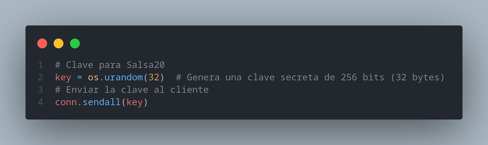
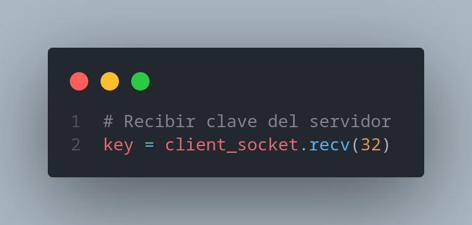
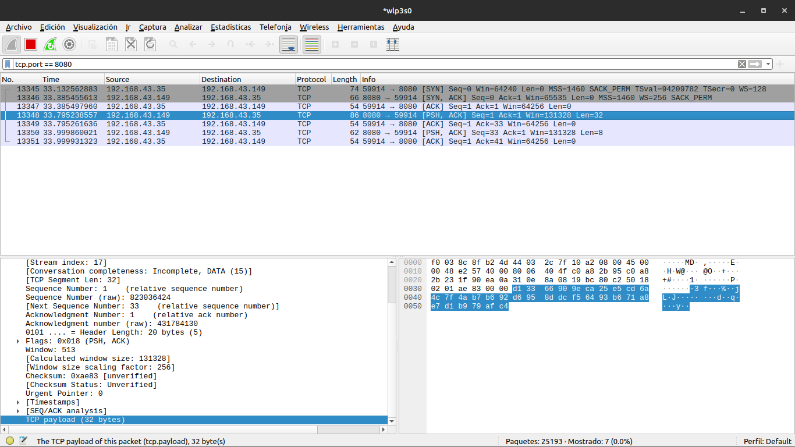
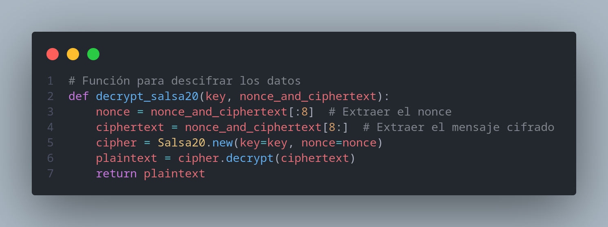
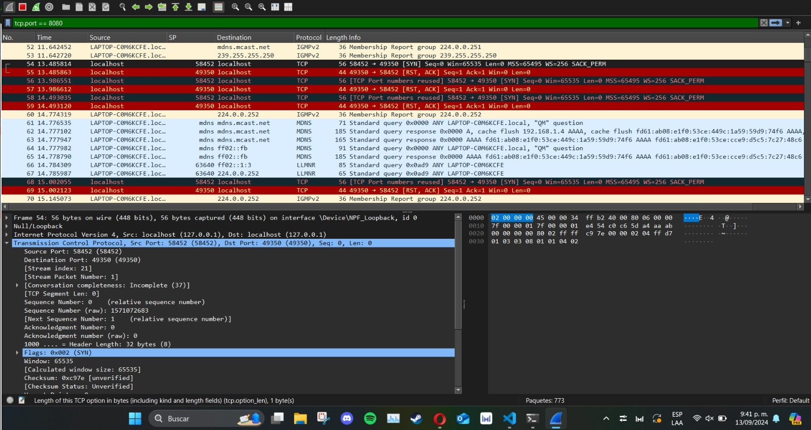

## Escenario 1: Comunicación Cifrada con Salsa20

1. *¿Es posible interceptar la llave simétrica de 256 bits durante su transmisión desde el servidor al cliente? Explique por qué sí o no y qué implicaciones tiene esto para la seguridad de la comunicación.*

    **Sí**, es posible que un atacante intercepte la llave, ya que esta es enviada por el **servidor** (como se observa en la **Imagen 1**) y es recibida por el **cliente** (como se observa en la **Imagen 2**). 

    La interceptación de la llave **compromete completamente** el cifrado de la comunicación, ya que el atacante podría desencriptar los mensajes y obtener la información original **sin mucho esfuerzo**, en nuestro caso la llave fue obtenida al monitorear la comunicación (**imagen 3**).

    ---

    ### Implicaciones de la interceptación:
    - **Desencriptación de mensajes**: El atacante puede acceder al contenido original.
    - **Compromiso de la seguridad**: Toda la información intercambiada queda expuesta.
    
   
    (imagen 1)

   
    (imagen 2)

   
    (imagen 3)

2. *¿Qué información puede ser obtenida por un atacante que esté monitoreando el tráfico? ¿Podría descifrar los mensajes cifrados con Salsa20? Justifique su respuesta.*

   Un atacante **podría observar los mensajes cifrados**, pero no podría descifrarlos sin conocer la llave simétrica. Sin embargo, si la llave fue comprometida durante el intercambio, el atacante **sí podría descifrar los mensajes**.

   En nuestro caso, la llave fue comprometida (imagen 3), por lo tanto, el atacante puede obtener los mensajes y, a partir de estos, **descifrarlos** utilizando la llave, el **nonce** y el **texto cifrado**.

   

   Para esto, el atacante podría implementar el código que se muestra en la **Imagen 4**.

   
    (imagen 4)

3. *Proporcione recomendaciones para mejorar la seguridad del intercambio de llaves en este escenario.*

   Se recomienda utilizar un protocolo seguro como TLS para proteger el intercambio de llaves o implementar un canala alterno, (como memoria USB, correo electrónico, o un archivo compartido en la nube).

---

## Escenario 2: Comunicación Cifrada con AES-256 en Modo CBC

1. *¿Cuáles son las ventajas y desventajas de utilizar un canal alterno para el intercambio de llaves simétricas en comparación con el primer escenario?*

   - **Ventajas**: Un canal alterno reduce las posibilidades de que un atacante intercepte la llave durante la transmisión en red.
   - **Desventajas**: Requiere más esfuerzo logístico y si el canal alterno es inseguro, hay mayor posibilidad de que la llave sea comprometida.

2. *¿Es posible que un atacante obtenga la llave simétrica de 256 bits en este escenario? ¿Por qué?*

   Es **menos probable** que un atacante obtenga la llave simétrica en este escenario, ya que la transmisión de la llave se realiza por un canal distinto al de la comunicación regular.En nuestro caso es imposible obtener la llave simetrica, ya que no tenermos como obtener acceso al otro canal.

   
    (imagen 5)

3. *Si el atacante logra capturar los paquetes cifrados con AES-256 en modo CBC, ¿podría descifrar los mensajes? Explique las posibles vulnerabilidades que podrían existir (por ejemplo, ataques de relleno).*

   Capturar los paquetes cifrados no permitiría descifrar los mensajes sin la llave. Sin embargo, el modo CBC es vulnerable a ataques como el de relleno (padding oracle), que puede permitir a un atacante manipular los mensajes cifrados o incluso descubrir información.

   
    (imagen 6)

4. *Sugiera mejoras en la implementación para mitigar riesgos de seguridad.*

   Para mejorar la seguridad al usar AES-256 en modo CBC, creemos que es fundamental agregar varias medidas adicionales. Primero, implementaríamos mecanismos de autenticación de mensajes como HMAC para asegurar que los datos no se hayan modificado y para verificar su integridad. Además, nos aseguraríamos de que el canal de comunicación sea seguro usando cifrado de transporte, como TLS, para proteger los datos mientras se transfieren. También utilizaríamos un esquema de padding seguro, como PKCS7, para prevenir problemas con el relleno. Finalmente, garantizaríamos que el Vector de Inicialización (IV) sea siempre aleatorio y único para cada cifrado, y manejaríamos las claves con mucho cuidado, asegurándonos de almacenarlas de forma segura.

---

## General

1. *Compare la seguridad ofrecida por los cifradores Salsa20 y AES-256 en modo CBC. ¿En qué escenarios uno podría ser preferido sobre el otro?*

      Preferimos **AES-256 en modo CBC** sobre **Salsa20**, principalmente por la robustez en la privacidad de la clave que ofrece. AES-256 proporciona una mayor seguridad en la gestión de la clave, ya que resulta mucho más difícil para un atacante obtenerla y comprometer la comunicación. Esto es crucial, especialmente cuando se considera que el cifrado debe ser a prueba de manipulaciones y accesible solo para los usuarios autorizados. Por lo tanto, en escenarios donde la seguridad y la protección de la clave son prioritarias, AES-256 se presenta como la opción más fiable.

2. *Exponga sus conclusiones sobre la importancia de la gestión segura de llaves en protocolos de cifrado simétrico. ¿Qué métodos adicionales podrían implementarse para asegurar un intercambio seguro de llaves?*

   ### Conclusiones sobre la Gestión Segura de Llaves en Protocolos de Cifrado Simétrico

   La **gestión segura de llaves** es fundamental para mantener la integridad y confidencialidad en los protocolos de cifrado simétrico. Una mala administración de las llaves puede comprometer completamente el cifrado, permitiendo a los atacantes desencriptar mensajes y acceder a información sensible. 

   Para garantizar un intercambio seguro de llaves, se deben implementar métodos adicionales como:

   - **Uso de protocolos seguros**: Protocolos como **TLS** protegen la transmisión de llaves mediante cifrado de transporte.
   - **Manejo adecuado de IVs**: Asegurar que el **vector de inicialización** sea aleatorio y único para cada cifrado.

   En resumen, incorporar estas medidas adicionales es esencial para proteger eficazmente la información cifrada y evitar vulnerabilidades en la comunicación.
