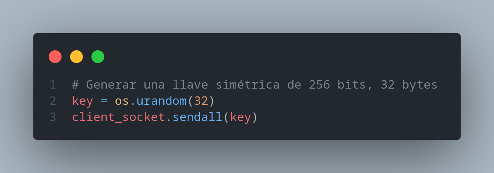

## Escenario 1: Comunicación Cifrada con Salsa20

1. *¿Es posible interceptar la llave simétrica de 256 bits durante su transmisión desde el servidor al cliente? Explique por qué sí o no y qué implicaciones tiene esto para la seguridad de la comunicación.*

    **Sí**, es posible que un atacante intercepte la llave, ya que esta es enviada por el **servidor** (como se observa en la **Imagen 1**) y es recibida por el **cliente** (como se observa en la **Imagen 2**). 

    La interceptación de la llave **compromete completamente** el cifrado de la comunicación, ya que el atacante podría desencriptar los mensajes y obtener la información original **sin mucho esfuerzo**, en nuestro caso la llave fue obtenida al monitorear la comunicación (**imagen 3**).

    ---

    ### Implicaciones de la interceptación:
    - **Desencriptación de mensajes**: El atacante puede acceder al contenido original.
    - **Compromiso de la seguridad**: Toda la información intercambiada queda expuesta.
    
   
    (imagen 1)

    
    (imagen 2)

    
    (imagen 3)

2. *¿Qué información puede ser obtenida por un atacante que esté monitoreando el tráfico? ¿Podría descifrar los mensajes cifrados con Salsa20? Justifique su respuesta.*

   Un atacante **podría observar los mensajes cifrados**, pero no podría descifrarlos sin conocer la llave simétrica. Sin embargo, si la llave fue comprometida durante el intercambio, el atacante **sí podría descifrar los mensajes**.

   En nuestro caso, la llave fue comprometida (imagen 3), por lo tanto, el atacante puede obtener los mensajes y, a partir de estos, **descifrarlos** utilizando la llave, el **nonce** y el **texto cifrado**.

   

   Para esto, el atacante podría implementar el código que se muestra en la **Imagen 4**.

   
    (imagen 4)

3. *Proporcione recomendaciones para mejorar la seguridad del intercambio de llaves en este escenario.*

   Se recomienda utilizar un protocolo seguro como TLS para proteger el intercambio de llaves o implementar un canala alterno, (como memoria USB, correo electrónico, o un archivo compartido en la nube).

---

## Escenario 2: Comunicación Cifrada con AES-256 en Modo CBC

1. *¿Cuáles son las ventajas y desventajas de utilizar un canal alterno para el intercambio de llaves simétricas en comparación con el primer escenario?*

   - **Ventajas**: Un canal alterno reduce las posibilidades de que un atacante intercepte la llave durante la transmisión en red.
   - **Desventajas**: Requiere más esfuerzo logístico y si el canal alterno no es seguro, la llave podría ser comprometida.

2. *¿Es posible que un atacante obtenga la llave simétrica de 256 bits en este escenario? ¿Por qué?*

   Es **menos probable** que un atacante obtenga la llave simétrica en este escenario, ya que la transmisión de la llave se realiza por un canal distinto al de la comunicación regular.En nuestro caso es imposible obtener la llave simetrica, ya que no tenermos como obtener acceso al otro canal.

3. *Si el atacante logra capturar los paquetes cifrados con AES-256 en modo CBC, ¿podría descifrar los mensajes? Explique las posibles vulnerabilidades que podrían existir (por ejemplo, ataques de relleno).*

   Capturar los paquetes cifrados no permitiría descifrar los mensajes sin la llave. Sin embargo, el modo CBC es vulnerable a ataques como el de relleno (padding oracle), que puede permitir a un atacante manipular los mensajes cifrados o incluso descubrir información.

4. *Sugiera mejoras en la implementación para mitigar riesgos de seguridad.*

   Implementar mecanismos de autenticación de mensajes como HMAC, asegurar que el canal alterno sea seguro y utilizar padding seguro (como PKCS7) para evitar ataques de relleno.

---

## General

1. *Compare la seguridad ofrecida por los cifradores Salsa20 y AES-256 en modo CBC. ¿En qué escenarios uno podría ser preferido sobre el otro?*

   Salsa20 es más rápido y consume menos recursos, lo que lo hace ideal para dispositivos con recursos limitados o comunicaciones en tiempo real. AES-256 en modo CBC, aunque más lento, es ampliamente considerado más seguro para datos que necesitan alta confidencialidad.

2. *Exponga sus conclusiones sobre la importancia de la gestión segura de llaves en protocolos de cifrado simétrico. ¿Qué métodos adicionales podrían implementarse para asegurar un intercambio seguro de llaves?*

   La gestión de llaves es crítica, ya que comprometer la llave simétrica expone toda la comunicación. Métodos como Diffie-Hellman, el uso de certificados y la implementación de canales seguros (como TLS) son esenciales para un intercambio seguro de llaves.